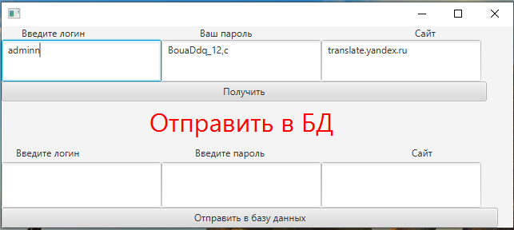

# PasswordManager

менеджер паролей

**Описание**:  

Небольшое приложение, для хранения паролей в БД

**Стек технологий**:
  - язык программирования Java.
  - библиотека JavaFX.
  - msssql
  - сборка maven
  
**Статус**:
  - Alpha 1.0.

**Скриншот**: 

## Конфигурация

Для работы требуется библиотека JavaFX.
Настроеить подключение к mssql
Драйверы Microsoft JDBC Driver 9.4

## Использование

- Запустите приложение
- Введите сайт, чтобы получить логин и пароль

## Тестирование продукта

Unit-тесты отсутствуют.

## Известные проблемы

Известных проблем нет.

## Обратная связь

Если у вас есть вопросы, проблемы, отчеты об ошибках и т. д., сообщите о проблеме в системе отслеживания проблем этого репозитория.

----

## Лицензии
1. [TERMS](TERMS.md)
2. [LICENSE](LICENSE)
